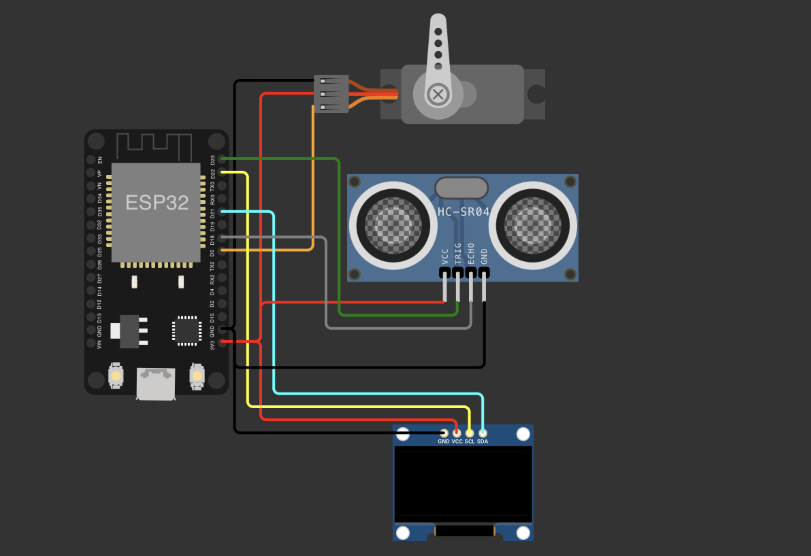

# BÁO CÁO BÀI TẬP LỚN - HỆ NHÚNG (IT4210 )

## MỤC LỤC 
- [A. TÁC GIẢ](#A-TÁC-GIẢ)
- [B. GIỚI THIỆU](#B-GIỚI-THIỆU)
- [C. HƯỚNG DẪN SỬ DỤNG](#C-HƯỚNG-DẪN-SỬ-DỤNG)
- [D. DANH SÁCH LINH KIỆN](#D-DANH-SÁCH-LINH-KIỆN)
- [E. SƠ ĐỒ NGUYÊN LÝ](#E-SƠ-ĐỒ-NGUYÊN-LÝ)
- [F. THIẾT KẾ PHẦN MỀM](#F-THIẾT-KẾ-PHẦN-MỀM)

## A. TÁC GIẢ
- Phạm Đặng Anh Đức - 20210207
- Nguyễn Thu Hà - 20210299
- Nguyễn Hữu Hiếu - 20215577
- Nguyễn Hữu Hậu - 20215573

## B. GIỚI THIỆU

- Trong phạm vi project này sẽ tập trung vào cách xác định khoảng cách và góc của vật thể (màn hình radar) bằng cách sử dụng cảm biến siêu âm và động cơ Servo. 

- Radar từ lâu đã được sử dụng để phát hiện các vật thể ở xa và hiển thị chúng trên màn hình. Với nhiều ứng dụng quân sự và hàng không, radar được sử dụng rộng rãi ngày nay. Hệ thống Adruino sonar tiên tiến có thể được sử dụng để giám sát khu vực cục bộ và cũng có thể quét các vật thể đáng ngờ. 

- Ở project này, nhóm đề xuất trình bày khái niệm này thông qua dự án radar được xây dựng dựa trên Arduino. Hệ thống được xây dựng sẽ liên tục quét khu vực ở góc 180 độ bằng cách sử dụng động cơ Servo và radar, cung cấp góc cũng như khoảng cách của vật thể từ nguồn, sau đó giá trị được gửi đến màn hình OLED. Hệ thống sử dụng sóng siêu âm để mô phỏng quét sonar hoặc radar 180 độ. Nó được gắn trên một động cơ Servo để tạo ra các góc quét và xoay cảm biến siêu âm.
## C. HƯỚNG DẪN SỬ DỤNG

### Hướng dẫn lắp mạch 
- 

### Hình ảnh minh hoạ
- 

### Video 
- https://github.com/nguyenha-meiii/RadarMonitor/blob/main/assets/demo_video.mp4

## D. DANH SÁCH LINH KIỆN
- Arduino Uno: 1

- Cảm biến sóng siêu âm HC-SR04: 1

- Động cơ Servo SG92R: 1

- Màn hình OLED I2C 0.96 SSD1306 - 4 PIN: 1 

## E. NGUYÊN LÝ HOẠT ĐỘNG

Sơ đồ nguyên lý của hệ thống bao gồm các thành phần sau:

### 1. Vi điều khiển (Arduino):
   - Là bộ điều khiển chính của hệ thống, nhận và xử lý dữ liệu từ cảm biến, điều khiển servo motor và màn hình OLED.

### 2. Cảm biến siêu âm (Ultrasonic Sensor):
   - Gồm hai chân chính: chân phát (Trig) và chân nhận (Echo).
   - Chân Trig được kết nối với một chân đầu ra số của Arduino.
   - Chân Echo được kết nối với một chân đầu vào số của Arduino.
   - Cảm biến siêu âm phát xung siêu âm, sau đó nhận tín hiệu phản xạ lại từ vật thể và tính toán khoảng cách dựa trên thời gian trễ giữa phát và nhận.

### 3. Servo Motor:
   - Được kết nối với một chân đầu ra PWM của Arduino.
   - Servo motor quay theo góc điều khiển bởi tín hiệu PWM từ Arduino.

### 4. Màn hình OLED:
   - Được kết nối với Arduino thông qua giao tiếp I2C (chân SDA và SCL).
   - Hiển thị thông tin như khoảng cách đo được từ cảm biến siêu âm, hình ảnh và thông điệp.

### Nguyên lý hoạt động của hệ thống:

1. Arduino gửi xung siêu âm từ chân Trig của cảm biến siêu âm.
2. Cảm biến siêu âm phát xung và nhận tín hiệu phản xạ lại từ vật thể qua chân Echo.
3. Arduino đo thời gian tín hiệu phản xạ và tính toán khoảng cách.
4. Khoảng cách được hiển thị trên màn hình OLED.
5. Nếu khoảng cách nhỏ hơn ngưỡng nhất định, đèn LED sẽ sáng.
6. Arduino điều khiển servo motor quay theo góc quy định.

## F. THIẾT KẾ PHẦN MỀM
### Tổng quan

Hệ thống radar này sử dụng cảm biến siêu âm và động cơ servo để quét khu vực xung quanh, đo khoảng cách và hiển thị thông tin trên màn hình OLED. Các thông tin về khoảng cách và góc được cập nhật liên tục, giúp theo dõi và phát hiện các vật thể trong phạm vi quét một cách hiệu quả. Các trường hợp có thể xảy ra được xử lý bằng cách tính toán và hiển thị dữ liệu theo thời gian thực, đảm bảo hệ thống hoạt động ổn định và chính xác.

### 1. Khởi Tạo Hệ Thống

- Cài đặt thư viện và khai báo biến: Code bắt đầu với khai báo các thư viện và biến global như Adafruit_GFX, Adafruit_SSD1306 để điều khiển màn hình OLED, ESP32Servo để điều khiển servo motor, và các biến cho cảm biến siêu âm và servo.

- Khởi tạo màn hình OLED và thiết lập ban đầu: Sử dụng Wire.begin(21, 22) để khởi tạo giao tiếp I2C, sau đó kiểm tra và khởi tạo màn hình OLED. Nếu không thành công, chương trình sẽ dừng lại.

- Splash screen: Hiển thị màn hình chào mừng splashScreen() trong 2 giây khi khởi động.

- Thiết lập chân nối và pin: Cài đặt chân nối cho cảm biến siêu âm và servo, cũng như thiết lập nút bấm boot button (pinUpBtn) dùng để chuyển đổi chế độ hoạt động của hệ thống.

### 2. Cơ Chế Quét của Radar

- Quét và hiển thị dữ liệu radar: Sử dụng servo motor để quét từ góc 0 đến 180 độ và ngược lại. Mỗi khi servo di chuyển, hệ thống đo khoảng cách bằng cảm biến siêu âm và hiển thị lên màn hình OLED.

- Hàm displayRadarData(): Dùng để hiển thị dữ liệu từ radar gồm khoảng cách (trong cm) và góc servo (0-180 độ) lên màn hình OLED.

### 3. Đo Khoảng Cách và Hiển Thị Dữ Liệu
- Hàm getDistance(): Sử dụng cảm biến siêu âm để đo khoảng cách. Hàm này gửi tín hiệu đi từ chân trig của cảm biến, đo thời gian echo và tính toán khoảng cách dựa trên thời gian này.

- Hiển thị dữ liệu lên OLED: Dữ liệu khoảng cách và góc servo được hiển thị trực tiếp trên màn hình OLED để người dùng có thể theo dõi.

### 4. Cơ chế chuyển mode ở OLED sử dụng boot button
- Phát hiện sự nhấn nút boot button (pinUpBtn): Trong loop(), hệ thống kiểm tra trạng thái của pinUpBtn. Nếu phát hiện nhấn, hệ thống thực hiện các hành động khác nhau tùy thuộc vào số lần nhấn:

    - Lần đầu tiên: Hiển thị màn hình "WELCOME".
    - Lần thứ hai: Kích hoạt chế độ quét của radar.
    - Lần thứ ba: Hiển thị hình ảnh bitmap của người phụ nữ.
    - Lần thứ tư: Hiển thị các thông tin cá nhân.
    - Sau đó biến đếm được đặt lại về 0 để hiện thị các mode ở trên

- Cơ chế debounce: Sử dụng delay(200) để chống lại hiện tượng giật nảy khi nhấn nút, đảm bảo chỉ nhận lệnh một lần duy nhất mỗi lần nhấn.
